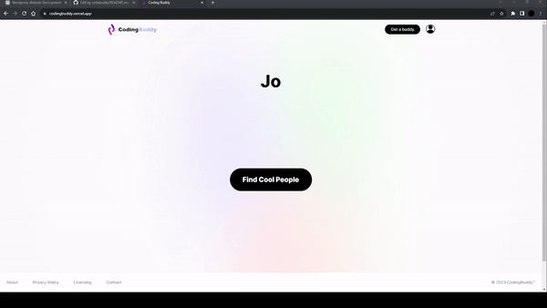
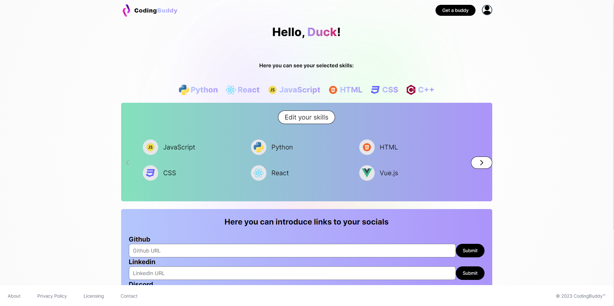

<h1 align="center"> Coding Buddy</h1>

<h2 align="center">Do you ever feel lonely when you code? Well, we got you covered. A solution made by programmers for programmers that help everyone interested in pair programming, hackathons, contests, or project building to find suitable people to get the job done. </h2>

<h2 align="center">Try it for yourself, find people, and start coding: </h2>  
<h1 align="center"><a href="https://codingbuddy.vercel.app/">Here!</a></h1>
 

<h1 align="center">Features:</h1>
<h3 align="center">Dynamically rendered and generated welcome text</h3>

  

<h3 align="center">Profile page where the user can set and edit their info</h3>

  

<h3 align="center">Search page where the user can search for other users based on their skills</h3>

  

<h3 align="center">If the user is logged in and has set their skills, they will be able to see other users that have the same skills as them directly on the main page</h3>

  

<h1 align="center">Next directions:</h1>
<table align="center">
  <tr>
    <td align="center">Integrated chat within the app</td>
  </tr>
  <tr>
    <td align="center">A much more secure and sustainable way of backend interactions</td>
  </tr>
  <tr>
    <td align="center">Mobile optimization</td>
  </tr>
  <tr>
    <td align="center">SEO optimization</td>
  </tr>
</table>

<h1 align="center">Team:</h1>
<table align="center">
  <tr>
    <td align="center"><a href="https://github.com/RaevschiCatalin">Raevschi Catalin: Front-end Developer</a></td>
  </tr>
  <tr>
    <td align="center"><a href="https://github.com/poenaruiulian">Poenaru Iulian: Front-end Developer</a></td>
  </tr>
</table>

